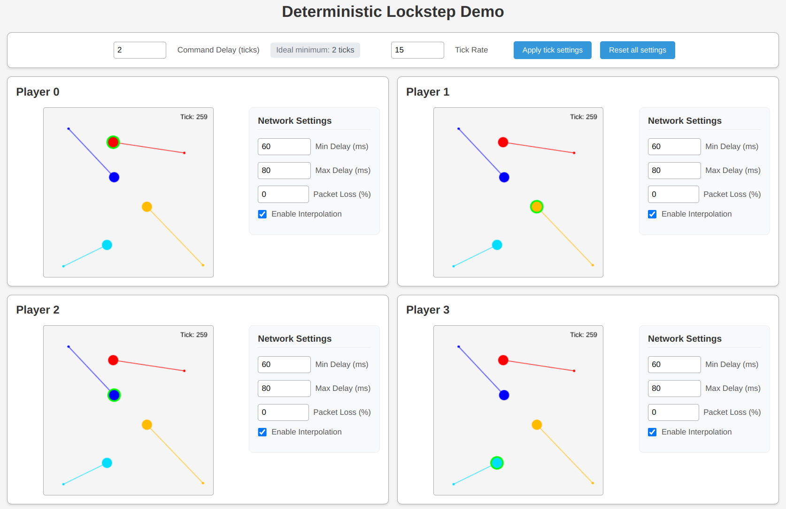

# Deterministic Lockstep Demo

### A local demo application built to showcase and experiment with deterministic lockstep protocol for multiplayer games, with simulated network conditions.

### <ins>Try it here: https://lockstep.pietrobassi.com</ins>



## What is Deterministic Lockstep?

Deterministic Lockstep is a multiplayer networking protocol primarily used in real-time strategy (RTS) and simulation games. Instead of syncing the entire game state across all clients, it synchronizes player inputs and relies on each client to simulate the game locally in exactly the same way.

The deterministic lockstep protocol originated from the early days of real-time strategy (RTS) games, particularly with games like Age of Empires and StarCraft. These games required precise synchronization of many units while minimizing network bandwidth, which was especially important in the dial-up internet era.

### How It Works

- **Input Collection**: Each client sends its input (e.g. player commands) for the current frame to all other clients.
- **Lockstep**: The game waits until it has received inputs from all players for that frame.
- **Simulation**: Once all inputs are received, the game advances one simulation step using those inputs.
- **Repeat**: This process is repeated every frame.

### Key Concepts

- **Determinism**: The core game logic must behave identically on all machines. Even a slight divergence in one client's game state can eventually break the entire simulation, leading to desynchronization and unexpected behavior.  
  Achieving this is non-trivial: the game must rely only on deterministic systems - including physics engines, math libraries (such as fixed-point math or IEEE-754-consistent floating-point operations; in this project, [`decimal.js`](https://github.com/MikeMcl/decimal.js/) is used), custom pseudo-random number generators (PRNGs) with a shared seed, and precise, consistent data transmission over the network.
- **UDP Redundancy**: Using TCP is generally not recommended - even for lockstep games where message order and reliable delivery are important. Instead, it's usually better to use UDP and implement the necessary reliability features at the application level.  
In this demo, we handle potential packet loss by re-sending commands for all ticks that haven't yet been acknowledged by other players. While this approach introduces some redundancy, it helps ensure smooth gameplay by preventing delays caused by missing or dropped packets.
- **Input Delay (Buffering)**: A small delay is added to compensate for network latency and occasional lag spikes. This ensures that all player inputs arrive in time, prevents simulation stalls, and helps maintain a smooth and responsive gameplay experience.

## Building and Running

```bash
# Install dependencies and start the development server
npm install && npm start

# Navigate to http://localhost:9000
```
